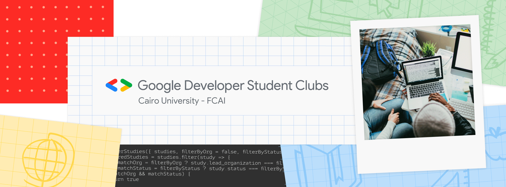
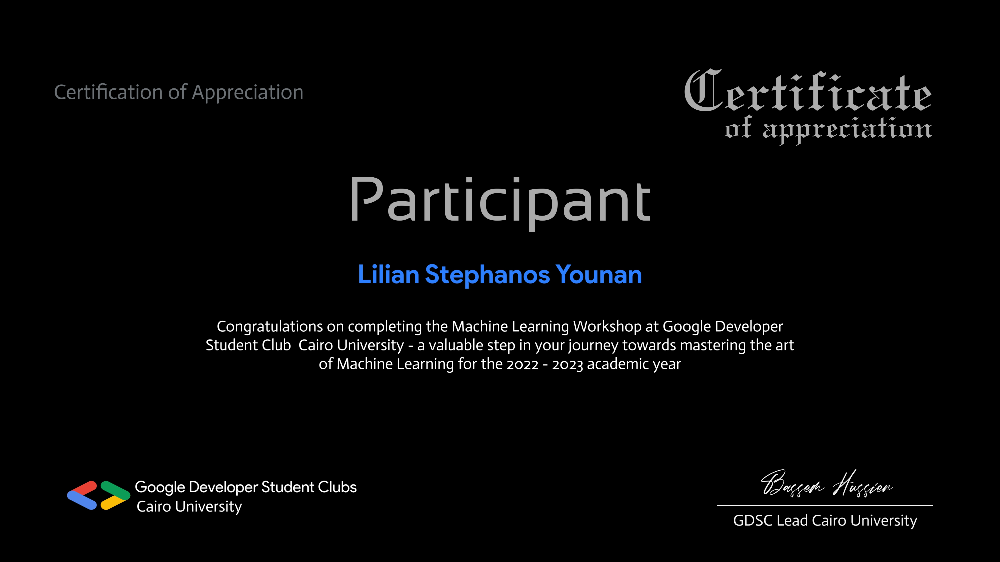

## GDSC ML Workshop 2023

**This repository I'm documenting my assignment solution during a GDSC machine learning workshop. In addition to the last project.**

## You will find my Final project here :-
[Building a Simple Machine Learning Model on Breast Cancer Wisconsin (Diagnostic) Data](https://github.com/liliansteven/Breast-Cancer-Diagnosis-KFold-and-RF-with-96-accuracy)

>“IF A TASK IS ONCE BEGUN , NEVER LEAVE IT TILL IT'S DONE. BE THE LABOR GREAT OR SMALL, DO IT WELL OR NOT AT ALL.” 

